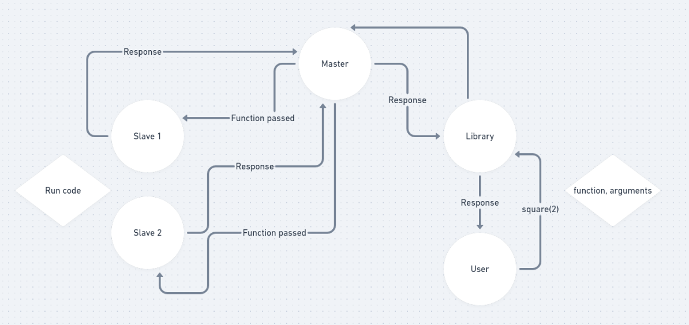

# DICER

## `DistrIbuted Code ExecutoR`

- Javascript Library to easily distribute your code among nodes and execute it
- Master Slave architecture
- Job distribution via ronund robin
- Low latency transfer via sockets.


### Pre-requisites

- You need a `Master` server setup with at least `1` slave connected to it
- The slaves need not be accessible publicly and can be behind a firewall or NAT
- The master should be accessible by the client
- Your jobs to distribute must be defined in a class

## Setup

- Step 1: Setup Master

```js
import Master from "../server";

/**
 * port used is controlled by process.env.PORT
 * default value is 3000
 * */
const master = new Master();
```

- Step 2: Setup Slave

```js
/**
 * @arg1 URL string
 * specifies the URL of the master
 *
 * @arg2 boolean logging
 * false by default. set to True to see execution logs
 * */
const slave2 = new Slave(
  process.env.MASTER_URL || "http://localhost:3000",
  true
);
```

- Step 3: Setup Client

```js
import Library from "../library";
import { SlaveResponse } from "../protocol";

/**
 * We define a class with the functions to be distributed across the nodes
 * The @lib.exec decorator is used to mark a function as ready for distribution
 * */

class Job {
  @lib.exec
  static square(x: number): any {
    return x ** 2;
  }

  @lib.exec
  static cube(x: number): any {
    return x ** 3;
  }

  @lib.exec
  static sqrt(x: number): any {
    return Math.sqrt(x);
  }

  @lib.exec
  static arrayMult(x: number[], y: number[]): any {
    let ans = [];
    for (let i = 0; i < x.length; i++) {
      ans.push(x[i] * y[i]);
    }
    return ans;
  }
}
```

## Usage

```ts
import assert from "assert";
import { SlaveResponse } from "../protocol";

interface SlaveResponse {
  result: any;
  time: number;
  error?: any;
}

const res: SlaveResponse = await Job.square(2);

const res2: SlaveResponse = await Job.sqrt(9);
console.log(`Took ${res2.time}ms `);

let arr1 = [1, 2, 3, 4, 5, 6, 7, 8, 9];
let arr2 = [10, 11, 12, 13, 14, 15, 16, 17, 18];

const re3: SlaveResponse = await Job.arrayMult(arr1, arr2);
if (res3.error) {
  //error handling goes here
}
```

## Examples

- See [index.test.ts](./src/test/index.test.ts) for examples
